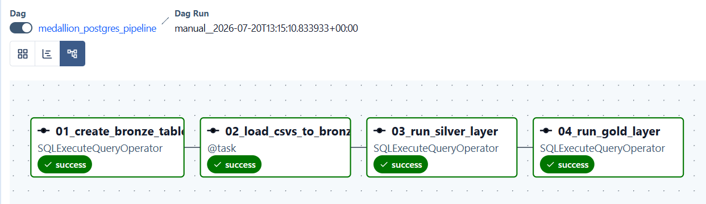
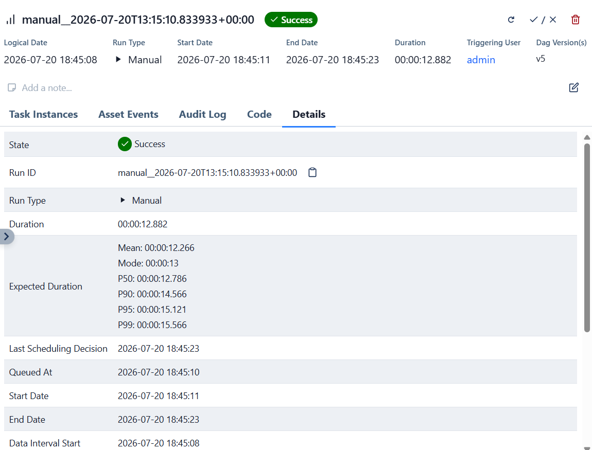
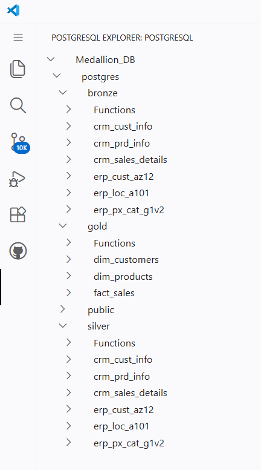
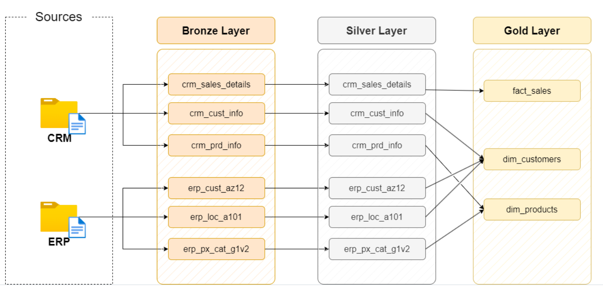

<div align="center">

# 🚀 Apache Airflow & PostgreSQL Medallion Pipeline

An automated, end-to-end **ELT Data Pipeline** orchestrating multi-source ERP/CRM ingestion into a PostgreSQL **Medallion Data Warehouse** using **Apache Airflow**, **Python**, and **Star Schema Data Modeling**.

---

[](https://airflow.apache.org/)
[](https://www.postgresql.org/)
[](https://www.python.org/)


</div>

---

## 📌 Executive Summary

Modern enterprise environments often face data quality issues due to disparate CRM and ERP source systems containing duplicate records, inconsistent formatting, and unstandardized schemas. 

This project addresses these challenges by implementing an automated **Medallion Data Warehouse Architecture** (`Bronze` ➔ `Silver` ➔ `Gold`). Using **Apache Airflow**, raw transactional data is continuously ingested, cleaned, standardized, and modeled into a business-ready **Star Schema** optimized for analytical querying and reporting.

---

## 🏗️ Data Warehouse Architecture

The pipeline follows a multi-tier Medallion design pattern to enforce progressive data refinement:

```
┌─────────────────────────┐          ┌─────────────────────────┐
│     CRM CSV Sources     │          │     ERP CSV Sources     │
└────────────┬────────────┘          └────────────┬────────────┘
             │                                    │
             └─────────────────┬──────────────────┘
                               │
            (Task 01 & Task 02: Ingestion & Load)
                               ▼
  ┌─────────────────────────────────────────────────────────┐
  │  🥉 BRONZE LAYER (Raw Ingestion)                        │
  │  • Stores raw ERP/CRM datasets exactly as received      │
  └────────────────────────────┬────────────────────────────┘
                               │
               (Task 03: Cleaning & Normalization)
                               ▼
  ┌─────────────────────────────────────────────────────────┐
  │  🥈 SILVER LAYER (Cleaned & Standardized Data)          │
  │  • Date parsing, string trimming, data deduplication    │
  └────────────────────────────┬────────────────────────────┘
                               │
               (Task 04: Star Schema Modeling)
                               ▼
  ┌─────────────────────────────────────────────────────────┐
  │  🥇 GOLD LAYER (Dimensional Analytical Model)           │
  │  • Production-ready Star Schema (Dimensions & Facts)    │
  └─────────────────────────────────────────────────────────┘
```

### 🏛️ Medallion Layer Specifications

| Layer | Type | Description | Key Transformations |
| :--- | :--- | :--- | :--- |
| **🥉 Bronze** | Raw Staging | Exact replica of source CRM/ERP CSVs | Direct COPY / Ingestion into PostgreSQL tables |
| **🥈 Silver** | Cleansed | Standardized tables with verified data quality | Whitespace trimming, code mapping (gender/marital status), type casting |
| **🥇 Gold** | Business | Dimensional Star Schema ready for BI/Analytics | Joins, business metrics computation, `dim_customers`, `dim_products`, `fact_sales` |

---

## 📸 Pipeline Execution & Visual Showcase

<div align="center">

### 1. Airflow Orchestration DAG Execution
*Automated end-to-end task execution pipeline showing all 4 Medallion pipeline tasks completing successfully:*



<br>

### 2. Task Details & Run Metrics
*Detailed view of Airflow SQL operators executing custom transformation logic:*



<br>

### 3. PostgreSQL Database Schemas
*Database layout organized into isolated `bronze`, `silver`, and `gold` schemas in VS Code:*



<br>

### 4. End-to-End System Architecture
*Full data movement and component interaction diagram:*



</div>

---

## 📂 Repository Structure

```text
.
├── dags/
│   └── medallion_postgres_pipeline.py  # Airflow DAG definition & TaskFlow logic
├── datasets/
│   ├── crm/                            # Raw CRM source files
│   └── erp/                            # Raw ERP source files
├── sql/
│   ├── 01_bronze_layer.sql             # Bronze schema DDL
│   ├── 02_silver_layer.sql             # Silver data cleaning & standardization queries
│   └── 03_gold_layer.sql               # Gold star schema transformations
├── sample_outputs/                     # Top 100 Markdown table previews for each layer
│   ├── bronze/
│   ├── silver/
│   └── gold/
├── docs/
│   └── images/                         # Pipeline screenshots & architectural diagrams
├── .gitignore                          # Excludes logs, virtualenvs, & runtime DB files
├── LICENSE
└── README.md
```

---

## 📊 Sample Data Previews

Inspect sample output records (top 100 rows) generated across each stage of the Medallion architecture directly inside the repo:

* 🥉 **Bronze Layer (Raw):** [`sample_outputs/bronze/`](sample_outputs/bronze/)
* 🥈 **Silver Layer (Cleaned):** [`sample_outputs/silver/`](sample_outputs/silver/)
* 🥇 **Gold Layer (Modeled):**
  * 👤 Customer Dimension: [`dim_customers.md`](sample_outputs/gold/dim_customers.md)
  * 📦 Product Dimension: [`dim_products.md`](sample_outputs/gold/dim_products.md)
  * 📈 Sales Fact Table: [`fact_sales.md`](sample_outputs/gold/fact_sales.md)

---

## 🛠️ Tech Stack & Prerequisites

* **Orchestration:** Apache Airflow 2.x
* **Database / Data Warehouse:** PostgreSQL 15+
* **Languages & Tooling:** Python 3.10+, SQL, Pandas, SQLAlchemy
* **Environment:** Docker / GitHub Codespaces

---

## ⚡ Quick Start Guide

### 1. Clone the Repository
```bash
git clone https://github.com/Jaswanth-12/airflow_postgres_medallion_pipeline.git
cd airflow_postgres_medallion_pipeline
```

### 2. Start PostgreSQL via Docker
```bash
docker run -d \
  --name postgres-db \
  -e POSTGRES_PASSWORD=postgres \
  -e POSTGRES_USER=postgres \
  -e POSTGRES_DB=postgres \
  -p 5432:5432 \
  postgres
```

### 3. Launch Airflow & Trigger DAG
```bash
# Start Airflow in standalone mode
airflow standalone
```
1. Open the Airflow UI at `http://localhost:8080`.
2. Unpause the **`medallion_postgres_pipeline`** DAG and click **Trigger DAG**.

---

## 📜 License

Distributed under the **MIT License**. See `LICENSE` for details.
